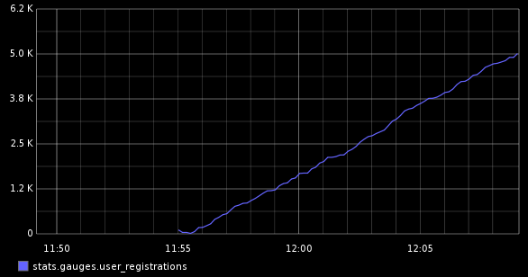
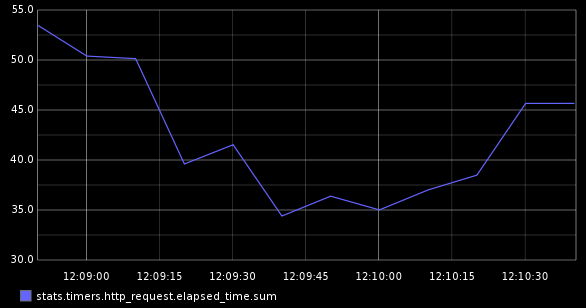
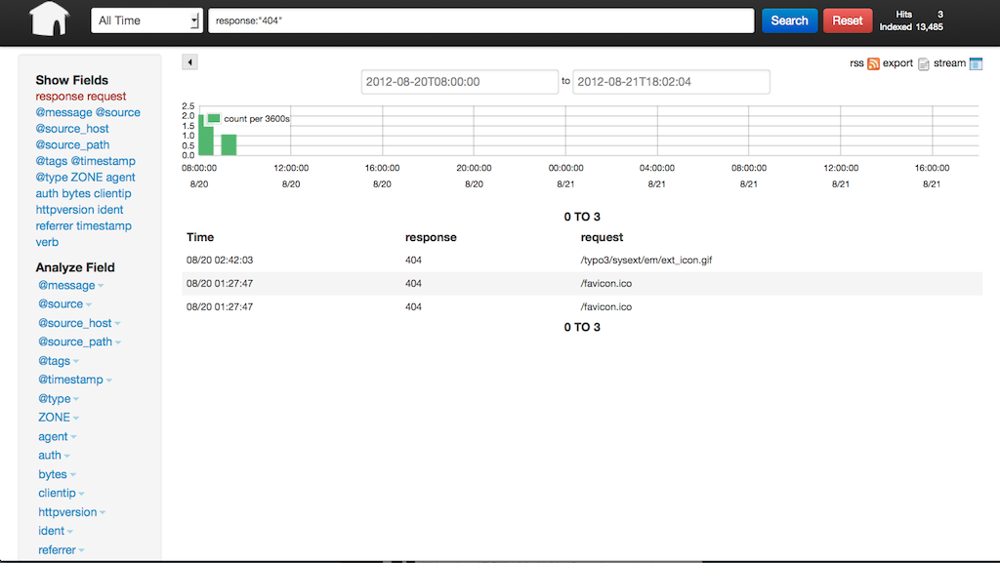

!SLIDE new-chapter center
# Turn plain text into business value 
TYPO3 Conference Asia 2012 
Christian Trabold

!SLIDE

# What are logs?

!SLIDE

# Logs == Plain Text

!SLIDE

# Log == Protocol

!SLIDE

# Every process creates logs

!SLIDE

    Aug 21 02:47:46 machine http://host/: - cms:
    Locking [simple::...]: Released lock

!SLIDE

    Aug 21 02:47:48 machine http://host/: - Core:
    File "/var/www/favicon.ico" was not found.

!SLIDE

    192.168.156.1 - - [20/Aug/2012:15:24:23 +0000]
    "GET /typo3/ajax.php
    HTTP/1.1" 200 7385 "http://host/index.php"
    "Mozilla/5.0 (Macintosh; Intel Mac OS X 10.7; rv:14.0)
    Gecko/20100101 Firefox/14.0.1"

!SLIDE new-chapter center

# Just boring text?

!SLIDE new-chapter center

# NO!

!SLIDE

# Interesing!
 
    192.168.156.1                   <= Who?
    [20/Aug/2012:15:24:23 +0000]    <= When?
    "GET /index.php                 <= What?
    HTTP/1.1" 200                   <= How?
    "Mozilla/5.0 (Macintosh…)       <= Who?
    Gecko/20100101 Firefox/14.0.1"  <= Who?

!SLIDE

# Alarming!

    192.168.156.1                   <= Who?
    [20/Aug/2012:15:24:23 +0000]    <= When?
    "GET /index.php?id=1 or 1=1 --  <= What?
    HTTP/1.1" 200                   <= How?
    "Mozilla/5.0 (Macintosh…)       <= Who?
    Gecko/20100101 Firefox/14.0.1"  <= Who?

!SLIDE new-chapter center heart

# <strong>♥ </strong> Heartbeat of your application

!SLIDE

And the best…

!SLIDE new-chapter center

# You can write own logs!

!SLIDE center

# TYPO3 API
    @@@ php
    t3lib_div::sysLog($msg, $extKey, $severity=0)
#### API change in TYPO3 6.0 [https://review.typo3.org/#/c/13604/](https://review.typo3.org/#/c/13604/)

!SLIDE

This <b>should</b> be implemented around the source code, including the Core and both frontend and backend, logging serious
errors.

<strong>… and for every action you find interesting!</strong>

!SLIDE

To implement the sysLog in your applications:

    @@@ php
    t3lib_div::sysLog(
        '[write message in English here]',
        'extension key'
    );

!SLIDE

# Severities

    @@@ php
    0 info (default)
    1 notice
    2 warning
    3 error
    4 fatal

<!--
    0 Emergency
    1 Alert
    2 Critical
    3 Error
    4 Warning
    5 Notice
    6 Informational
    7 Debug

[http://en.wikipedia.org/wiki/Syslog](http://en.wikipedia.org/wiki/Syslog)
-->

!SLIDE

# Next:  Collect TYPO3 logs in system log

!SLIDE

# Send TYPO3 logs to syslog:

    @@@ php
    $TYPO3_CONF_VARS['SYS']['systemLog'] = 'syslog,USER';

_USER_ namespace avoids conflicts with other logs

!SLIDE

# Log every message 

    @@@ php
    $TYPO3_CONF_VARS['SYS']['systemLogLevel'] = '0';

!SLIDE

# No need for logging in database anymore

    @@@ php
    $TYPO3_CONF_VARS['SYS']['belogErrorReporting'] = 0;

== More DB performance! :)

!SLIDE

# localconf.php
    @@@ php
    $TYPO3_CONF_VARS['SYS']['systemLog'] = 'syslog,USER';
    $TYPO3_CONF_VARS['SYS']['systemLogLevel'] = '0';
    $TYPO3_CONF_VARS['SYS']['belogErrorReporting'] = 0;

!SLIDE

Also make shure you enable PHP error logging in php.ini

    log_errors = On

!SLIDE

# Example use cases

!SLIDE 

- Newsletter subscribe / unsubscribe
- User log in / out
- Failed Backend logins (Attacks?)
- Contact form submitted 

.notes Q: Why do I need this when I have Google Analytics? A: Because
you can manage your data more flexible

!SLIDE bullets incremental

# Important

* Write Logs!
* Whereever you feel the need
* Logs provide useful values
* Values can be collected for metrics
* Metrics show business patterns 
* Beware of cached elements

!SLIDE center

# Measure to improve

!SLIDE center

# You can’t improve what you  don’t measure.

#### [http://www.littlethingsmatter.com/blog/2010/08/23/you-cant-improve-what-you-dont-measure/](http://www.littlethingsmatter.com/blog/2010/08/23/you-cant-improve-what-you-dont-measure/)

!SLIDE

# Advanced metrics

!SLIDE center

# User registrations
 
#### [http://blog.pkhamre.com/2012/07/24/understanding-statsd-and-graphite/](http://blog.pkhamre.com/2012/07/24/understanding-statsd-and-graphite/)

!SLIDE center

# Render time 

 
#### [http://blog.pkhamre.com/2012/07/24/understanding-statsd-and-graphite/](http://blog.pkhamre.com/2012/07/24/understanding-statsd-and-graphite/)

!SLIDE new-chapter center

# Best practices

!SLIDE

# Normalize the logs
Convert different log formats into structured JSON objects

!SLIDE

.notes Because the log formats differe A LOT, we need to normalize and
enrich them

# Proven Architecture

                       fetch  convert  send
    TYPO3 ---> SYSLOG <-----  LOGSTASH ---> WEB INTERFACE

Web Interfaces like Kibana, Graylog2

!SLIDE

# Logstash
Normalize logs & creates structured JSON objects from plain text

!SLIDE

# Kibana
Focused on searching logs and statistics

!SLIDE

# Graylog2
Focused on reporting and streamlining logs 
Searching is a sub-feature

!SLIDE

# If in doubt
# <em>log it!</em>

!SLIDE

# Careful with user data
# <em>only store anonymous IDs</em>

!SLIDE new-chapter center

# Showtime!

!SLIDE full 

